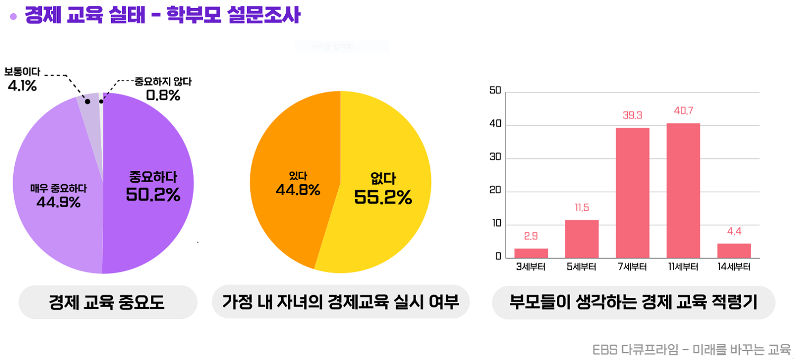

  
   
  

# 🦊 모아 아일랜드[Moa Island]

- 서비스명 : 모아 아일랜드[Moa Island]

- 개발기간 : 2022.10.11 ~ 2022.11.21 (6주)

- 팀명 : 뿌요😇

- 팀원 : 오도석(팀장), 김민정, 박채림, 박한훈, 이병헌, 최연지

  

## 목차

* [서비스 소개](#🌈-서비스-소개)
* [주요 시나리오](#👶-주요-시나리오)
* [기대효과](# )
* [향후 계획](#🏃-향후-계획)
* [기술 스택](#💻-기술-스택)
* [팀원 역할](#👨‍👩‍👧‍👦-팀원-역할)
* [소감](#📖-소감)
* [산출물](#📚-산출물)

  

# 🌈 서비스 소개

## 1. 모아 아일랜드[Moa Island] 란?

- **어린이 대상 경제 교육을 위한 서비스**로, 게임(또는 부모님의 미션)을 통해 게임 재화를 지급받고 이를 은행에 예금·적금하거나 주식 거래 등 다양한 경제 활동을 경험할 수 있습니다.*
  
## 2. 서비스 기획 배경
  
  

    
    
  

- 최근 많은 사람이 경제 교육에 관심을 갖게 되고 중요도 또한 올라가고 있습니다.
- 어린이 대상 경제 교육 중요도 또한 상승하고 있는 가운데 많은 부모님은 자신의 아이들에게 경제 교육의 필요성을 느끼지만 아직 교육을 하지 않거나 어떻게 가르쳐야 하는지 모르는 경우가 많습니다.
- 이런 문제점을 해결하기 위해 어린이 대상 경제 교육 서비스를 제공함으로써 어린이들이 쉽고 재미있게 경제 교육을 학습하고 경험할 수 있도록 기획하였습니다.

[어린이를 위한 경제교육 관련 기사] https://www.econoi.com/news/articleView.html?idxno=32733

    

# 👶 주요 시나리오

## Chapter 0. 회상
> + ### 돈을 흥청망청써서 저주를 받아 모아랜드로 이동하다!

 

## 1. 내용
   - 내용

   
   <h3>Gif</h3>

  

## Chapter 1. 튜토리얼 섬
> + ### 캐릭터 이름 설정
> + ### 조작법(이동, 점프, 대화, 지도, 소리조절, 도움말) 소개

 

## 1. 내용
   - 내용

   
   <h3>Gif</h3>

  

## Chapter 2. 소비 섬
> + ### 현명한 소비, 미래를 위한 저축
> + ### 게시판 확인
> + ### 별 모으기

 

## 1. 내용
   - 내용

   
   <h3>Gif</h3>

  

## Chapter 3. 은행 섬
> + ### 은행에 돈을 넣으면 무슨 일이 벌어질까?
> + ### 사인
> + ### 

 

## 1. 내용
   - 내용

   
   <h3>Gif</h3>

  

## Chapter 4. 주식 섬
> + ### 나도 이제 어엿한 주주
> + ### 투자 기업 선택 (분기점)
> + ### 

 

## 1. 내용
   - 내용

   
   <h3>Gif</h3>

  

## Chapter 5. 세금 섬
> + ### 왜 세금을 내야할까요?
> + ### 다리 건설
> + ### 

 

## 1. 내용
   - 내용

   
   <h3>Gif</h3>

  

## Chapter 6. 다시 돌아온 집
> + ### 저주가 풀리고 다시 사람으로 돌아온 주인공!

 

## 1. 내용
   - 내용

   
   <h3>Gif</h3>

  

## Chapter 7. 퀴즈
> + ### 퀴즈를 풀고 수료증을 받자!

 

## 1. 내용
   - 내용

   
   <h3>Gif</h3>

  

# 🌍 'Moa Island'를 이용하면 일어나는 기대효과!

 - 장점
    - .
 - 단점
    - .

  

# 🏃 향후 계획

1. .
2. .
3. .

  

# 💻 기술 스택

   

 

> + ### Unity : **Unity, C#**
> + ### Front-End : React
> + ### Back-End : **AWS EC2, Spring, Jenkins, Docker**
> + ### 기획 : Notion, **Figma**
> + ### 협업 : **Plastic SCM, GitLab, Jira**, Matter Most, Webex

  

# 👨‍👩‍👧‍👦 팀원 역할

| 팀원 | 직무 | 주요 업무 |
| - | - | - |
| 공통 | - |- 기획 : Notion, UI/UX(Kakao Oven/**Figma**), DB설계, 기능명세서 - 협업 : 코드 컨벤션 구성, 데일리 스크럼, **GitLab, JIRA**, 간트 차트 - **기술 : Android(MVVM/Hilt), Kotlin, Firebase**, nav_graph 설계|
| **김민정 😀** | **Front-End Unity** | **- 담당 섬 : 퀴즈** - 기능 : 현위치 지도, 퀴즈, 파일 다운로드 - 기타 : . |
| **박채림 🤗** |  **Back-End Unity**  | **- 담당 섬 : 은행 섬** - 기능: 사인 - 기타 : PPT 자료 구성 및 발표 |
| **박한훈 😆** |  **Front-End Unity**  | **- 담당 섬 : 소비 섬** - 기능: . - 기타 : ReadMe 작성 |
| **오도석(팀장) 🙄** |  **Back-End Unity**  | **- 담당 섬 : 세금 섬** - 기능: 캐릭터 퀘스트 대화창 - 기타 : 포팅메뉴얼 |
| **이병헌 😎** |  **Front-End Unity**  | **- 담당 섬 : 주식 섬** - 기술: .  - 기타 : PPT 자료 구성 및 발표 |
| **최연지 😄** |  **Back-End Unity**  | **- 담당 섬 : 튜토리얼 섬** - 기술: . - 기타 : . |

  

# 📖 소감

| 팀원 | 소감 |
| - | - |
| 공통 | - |
| **김민정 😀** | **Unity를 이번 기회에 처음 사용했는데, 처음에는 걱정이 됐지만 실제로 공부하다 보니 생각보다 금방 배울 수 있었습니다. 기존에 써왔던 기술이 아닌 새로운 기술을 배우고 사용할 수 있어 좋았고, 싸피 2학기 중 진행한 세 가지 프로젝트 중 가장 재미있게 개발했던 프로젝트입니다. 주제 또한 팀원분들 모두의 취향에 맞췄기 때문에 더 재밌었던 것 같고, 서로 기능을 보완해주고 새로운 의견을 내면서 좋은 결과물 또한 낼 수 있어 큰 경험이 되었습니다.** |
| **박채림 🤗** |  **원래 기획했던 Three.js부터 Unity에 오기까지도 우여곡절이 많았고, 또 처음하는 C# 기반의 Unity를 사용하는 것도 힘들었던 점이 많았지만, 팀원들 덕분에 프로젝트를 잘 마무리할 수 있었습니다. 기존에 주로 백엔드 개발을 맡았어서 내가 적용하고 코드를 짠 캐릭터의 움직임이나 이미지를 바로 눈으로 확인할 수 있었다는게 색다르고 즐거운 경험이었습니다. 게임을 만드는 것의 특성상 기존에 작성했던 API 명세서, FIGMA 대신 직접 손으로 핸드캐치를 하고 어린이들이 이해할 수 있도록 수 없이 스토리 스크립트를 고쳐가는 과정도 의미 있었습니다. 모두들 감사합니다!**  |
| **박한훈 😆** |  **1년 가까이 해오던 Web/App개발이 아닌 Unity를 하는 것이 처음에는 두려웠지만 생각보다 적성에 잘 맞았고 재밌게 했던 것 같습니다.  머리 속에서 생각하던 것들을 바로 구현하고, 평소 즐겨하던 알고리즘을 직접 적용하는 과정에서 성취감을 느껴 정말 재밌었습니다. 또한, 결합도는 낮추고 응집도를 높이려고 노력한 점이 프로젝트 후반부에서 버그 수정 과정에 있어 큰 도움이 되었고 좋은 결과물을 낼 수 있었다고 생각합니다. 지금까지 해온 프로젝트들을 통해 새로운 언어를 배운다는 것이 더 이상 두렵지 않습니다.**  |
| **오도석(팀장) 🙄** |  **팀원 모두가 Unity 및 C#이 처음 이어서 씬 제작, 캐릭터 이동, 애니메이션, collider 설정 등 기본적인 부분 모두 몰랐지만 팀원 모두가 함께 기술을 잘 습득해서 프로젝트를 마무리한 것 같아서 좋은 경험이 된 것 같습니다.**  |
| **이병헌 😎** |  **그동안 python, javascript와 같은 동적 언어를 활용했지만, 이번 프로젝트에서는 정적 언어인 C#을 사용해서 새로운 경험을 할 수 있었습니다. 웹 프로젝트만 진행하다 게임 프로젝트를 처음 진행해 기획과 개발 단계에서 새로운 경험을 할 수 있었습니다.**  |
| **최연지 😄** |  **앞선 세 번의 프로젝트에서 웹 서비스를 개발하던 것과 달리 유니티 기반 게임을 개발하게 되어 학습할 것도 많고, Plastic SCM 같은 새로운 툴에 적응하는 것이 쉽지 않았지만 매번 해오던 것이 아닌 것을 경험할 수 있었습니다. 아이들의 눈높이에 맞춰 스토리를 기획하고, 웹과는 다르게 직접 스케치를 통해 목업을 그리고, 게임에 필요한 다양한 오브젝트, 음악, UI 등을 찾아가는 과정까지 새로운 경험을 할 수 있어서 좋았습니다.**  |

  

# 📚 산출물

### **[Notion]** https://www.notion.so/c8c7f19d55e04581a55fad5879562696

### **[Figma]** https://www.figma.com/file/Q0hunYoYFlioTzJBAiKeFW/D104-%EC%9E%90%EC%9C%A8-%ED%94%84%EB%A1%9C%EC%A0%9D%ED%8A%B8?node-id=0%3A1&t=u6Ir87r1q53Rw3SH-0

### **[기획서]** https://www.notion.so/54e31eeed1774549acd47c8894be3fdb

### **[스토리 및 퀘스트]** https://www.notion.so/28f12c321bc0471c91c85deeccaaa3a1

### **[기능 명세서]** https://www.notion.so/42567cbdbd7d42078f6ddd11053c936d

### **[회고록]** https://www.notion.so/d856aac4f9d3442883efb39cff89eb75

### **[UCC]** Git Lab 내 exec 폴더 참조

### **[포팅 메뉴얼]** Git Lab 내 exec 폴더 참조

# 
