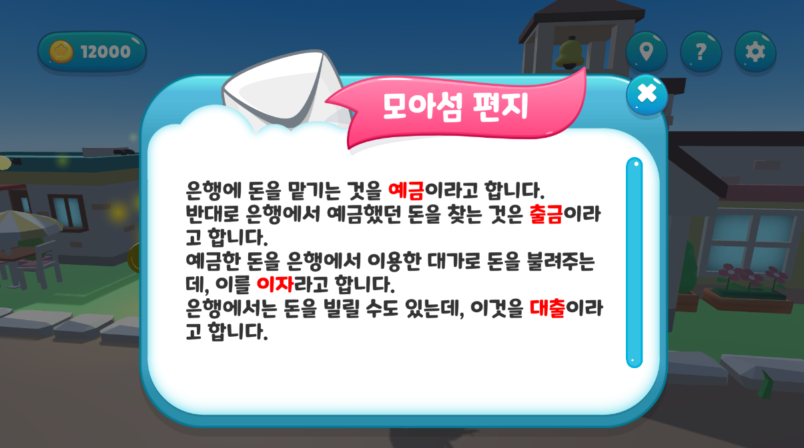
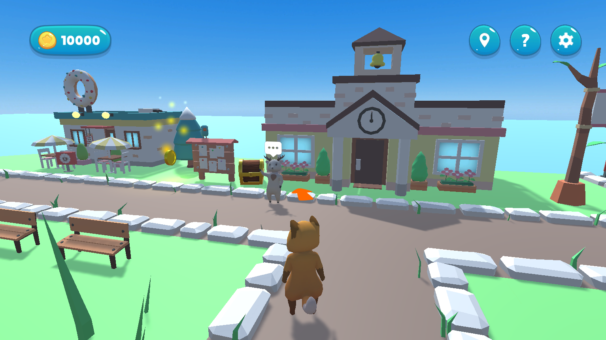
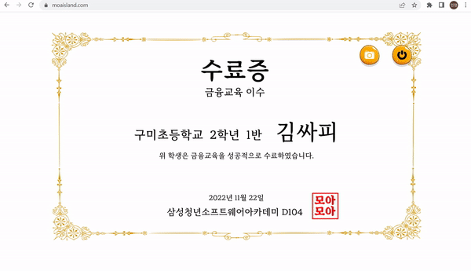

  
   
  

# 🦊 모아 아일랜드[Moa Island]

- 서비스명 : 모아 아일랜드[Moa Island]
- 개발기간 : 2022.10.10 ~ 2022.11.25 (7주)
- 팀명 : 뿌요😇
- 팀원 : 오도석(팀장), 김민정, 박채림, 박한훈, 이병헌, 최연지

  

# 목차

* [🌈 서비스 소개](#🌈-서비스-소개)
* [👶 주요 시나리오](#👶-주요-시나리오)
* [🌍 'Moa Island'를 이용하면 일어나는 기대효과!](#🌍-'Moa-Island'를-이용하면-일어나는-기대효과!)
* [#🏃 향후 계획](#🏃-향후-계획)
* [💻 기술 스택](#💻-기술-스택)
* [👨‍👩‍👧‍👦 팀원 역할](#👨‍👩‍👧‍👦-팀원-역할)
* [📖 소감](#📖-소감)
* [📚 산출물](#📚-산출물)

  

# 🌈 서비스 소개

## 1. 모아 아일랜드[Moa Island] 란?

- **어린이 대상 경제 교육을 위한 서비스**로, 게임(또는 부모님의 미션)을 통해 게임 재화를 지급받고 이를 은행에 예금·적금하거나 주식 거래 등 다양한 경제 활동을 경험할 수 있습니다.
  
## 2. 서비스 기획 배경

  

    
    
  

- 최근 많은 사람이 경제 교육에 관심을 갖게 되고 중요도 또한 올라가고 있습니다.
- 어린이 대상 경제 교육 중요도 또한 상승하고 있는 가운데 많은 부모님은 자신의 아이들에게 경제 교육의 필요성을 느끼지만 아직 교육을 하지 않거나 어떻게 가르쳐야 하는지 모르는 경우가 많습니다.
- 이런 문제점을 해결하기 위해 어린이 대상 경제 교육 서비스를 제공함으로써 어린이들이 쉽고 재미있게 경제 교육을 학습하고 경험할 수 있도록 기획하였습니다.

[어린이를 위한 경제교육 관련 기사] https://www.econoi.com/news/articleView.html?idxno=32733

    

# 👶 시나리오 및 기능 소개

## 로딩 페이지

   

      
   

## 공통기능

### 1. 캐릭터
   - 이동

   

      
   

   - 상호작용
   - 소리
### 2. 맵 구성

   Unity Asset Store - [**Cartoon Town - Low Poly Assets**](https://assetstore.unity.com/packages/3d/environments/cartoon-town-low-poly-assets-74020?locale=ko-KR)
    
### 3. 조작법

   

      
   

### 4. 현위치 지도

   

      
   

### 5. 소리 설정

   

      
   

### 6. 챕터 완료 후 스탬프 및 Fade In/Out 

   

      
   

### 7. 팝업 : 각 챕터에서 꼭 필요한 개념들을 모아섬 편지로 다시 한번 강조

   

      
   

  

## Chapter 0. 회상
> 돈을 흥청망청써서 저주를 받아 모아랜드로 이동하다!

 

   

      
   

  

## Chapter 1. 튜토리얼 섬
> ### 학습목표  
> + 게임을 플레이하기 위한 조작법에 대해 학습할 수 있음

 

### 주요 퀘스트

1. 플레이어 이름 설정 - 게임 플레이 시 사용되는 플레이어 이름을 입력받아 설정

   

      
   

 

2. NPC와 상호작용 - 튜토리얼 NPC를 찾아가 기본 조작법과 GUI에 대해 학습

   

      
      
   

  

## Chapter 2. 소비 섬

   

> ### 학습목표
> + 주인공의 지난 1년간 소비 내역을 보고 잘못된 점을 찾아 보다 나은 소비 방법에 대해 학습함
> + 간단한 미션을 통해 유저가 참여할 수 있는 기회 제공함

 

### 주요 퀘스트

1. 게시판 확인 - 특정 항목에 치중된 소비의 문제점을 파악

   

      
   

 

2. 별 모으기 - 게임 플레이간 사용할 재화를 직접 획득

   

      
   

 

3. 다음 섬으로 이동

   

      
   

  

## Chapter 3. 은행 섬

   

> ### 학습목표
> + 은행의 역할을 소개하고 통장을 만드는 과정을 경험
> + 만든 통장을 활용해 은행을 이용하는 경험
> + NPC를 통해 예금, 출금, 대출, 이자에 대한 개념을 학습

 

### 주요 퀘스트

1. 통장 만들기 및 사인 : 은행을 이용하기 위해 통장을 만들 때 실제로 도장을 찍거나 사인을 한다는 점을 감안하여 플레이어가 직접 사인을 하는 퀘스트 진행

   

      
   

 

2. 통장 사용해 은행 이용 : 만든 통장을 이용해 은행을 이용하고 예금, 출금, 대출, 이자에 대한 개념을 학습하는 퀘스트 진행

 

3. 플레이어 이름, 사인, 서비스를 진행한 날짜를 통장에 넣어 흥미를 높임

   

      
      
   

  

## Chapter 4. 주식 섬

   

> ### 학습목표
> + 주식의 개념과 가격 변동 원리에 대해 이해
> + 주식 투자 위험에 대해 이해하고 투자에 적합한 기업과 부적합한 기업 구분

 

### 주요 퀘스트

1. 회사를 운영하는 NPC와 대화

   

      
      
   

 

2. 투자할 회사를 선택하고 그에 따른 결과 제공

   

      
      
   

  

## Chapter 5. 세금 섬

   

> ### 학습목표
> + 세금의 정의 및 세금을 내야하는 이유에 대해서 학습
> + 세금으로 어떠한 일을 하는지에 대해서 학습

 

### 주요 퀘스트 : 세금을 내지않은 캐릭터를 찾아서 세금을 받아와서 공공재인 다리를 건설

1. 세금의 정의, 세금 받아오기 미션

   

      
   

 

2. 세금의 정의를 다시 언급, 세금 받아오기 미션 완료

   

      
   

 
3. 세금을 사용해서 공공재인 다리를 건설

   

      
   

  

## Chapter 6. 다시 돌아온 집
> + 저주가 풀리고 다시 사람으로 돌아온 주인공!

 

   

      
   

  

## Chapter 7. 퀴즈
> ### 학습목표
> + 전체 챕터를 통해 배운 개념들을 복습하고 이해도를 확인할 수 있음
> + 수료증을 발급함으로써 학습 기관 혹은 보호자가 게임 플레이어의 성취도를 확인 가능

 

### 주요 퀘스트

1. 플레이어 정보 입력: 학교명, 학년, 반, 이름 입력

   

      
   

 

2. 퀴즈: 총 5문제, 각 20점. 60점 이상 취득 시 수료증 발급, 60점 미만 취득 시 퀴즈 재도전

   

      
      
   

 

   

      
   

 

3. 수료증: 입력한 정보를 바탕으로 수료증 발급 및 ‘다운로드’ 폴더에 저장

   

      
   

 

4. 종료: 게임 시작 화면으로 전환

  

# 🌍 'Moa Island'를 이용하면 일어나는 기대효과!

 - 게이미피케이션(Gamification), 유저 친화적 UI/UX 적용해 유저들에게 경제 교육 효과적으로 진행
 - 저학년부터 자연스럽게 경제를 접하도록 유도
 - 교육 진행 여부를 수료증을 통해 학부모/교사가 확인 가능하므로 교육 컨텐츠로 활용 기대

  

# 🏃 향후 계획

 - 금융/교육 기관과의 연계: 금융/교육 기관과의 연계를 통해 초등학생들에게 서비스 제공 및 수료증 발급
 - 커리큘럼/시나리오 추가: 생애주기별 경제 학습 순서에 따라 추가적인 커리큘럼 및 시나리오 개발
 - 다양한 게임 컨텐츠 추가: 집중도와 몰입도를 높이기 위해 다양한 게임 컨텐츠 추가 개발

  

# 💻 기술 스택

   

 

> + Unity : **Unity, C#**
> + Front-End : React
> + Back-End : **AWS EC2, Spring, Jenkins, Docker**
> + 기획 : Notion, **Figma**
> + 협업 : **Plastic SCM, GitLab, Jira**, Matter Most, Webex

  

# 🎄 프로젝트 진행

### 1. Plastic SCM : 676개의 체인지 셋 
 - Unity의 형상관리를 위해 Plastic SCM을 사용하였습니다. 각 씬 마다 branch를 생성해 기능을 추가하고 합치는 작업을 반복하였습니다. 

   

      
   

 

### 2. Notion
 - 기획 및 공유가 필요한 정보들을 작성하여 불필요한 시간 낭비를 줄이도록 하였습니다. 

   

      
   

 

### 3. MatterMost
 - 실시간으로 공유가 필요한 작업들은 MatterMost의 채널을 이용하여 공유하였습니다.

   

      
   

 

### 4. Jira
+ 월요일 아침마다 한 주 동안 해야할 일을 정리하고 Jira에 업데이트 하였습니다.
+ 또한 데일리 스크럼을 진행하며 자신이 해야할 일과 한 일을 팀원들과 공유하여 매주 계획과 다르게 흘러간 이슈들은 최신화하여 관리해 주었습니다.
   1. 에픽은 맡은 `EP1. 튜토리얼 섬`과 같이 맡은 섬을 기준으로 생성하였습니다.
   2. 스토리는 각 섬의 필요한 큰 기능을 기준으로 나누어 `EP1 : 캐릭터` 와 같이 구성하였습니다.
   3. 태스크는 스토리의 세부적인 기능으로 `캐릭터 이동시 카메라 조정` , `NPC1과의 대화` 등으로 관리하였습니다.
   4. 번다운차트

 - 2주차 (프로젝트 기획 및 목업 완료)
    

      
   

 - 3주차 (Unity 개인학습 완료)
   

      
   

 - 4주차 (에셋 받기 전 섬 구분 및 담당 섬 기초 잡기)
   

      
   

 - 5주차 (유니티 마무리)
   

      
   

 - 6주차 (에러 수정 및 Documentation, 발표준비)
   

      
   

  

# 👨‍👩‍👧‍👦 팀원 역할

| 팀원 | 직무 | 주요 업무 |
| - | - | - |
| 공통 | - |- 기획 : Notion, UI/UX(Kakao Oven/**Figma**), 기능명세서 - 협업 : 코드 컨벤션 구성, 데일리 스크럼, GitLab, JIRA, 간트 차트, Notion - **기술 : Unity, PlasticSCM, EC2** - 기능: 섬 Asset 배치, 캐릭터 기본 이동, 카메라 고정, 빛 조절, Skybox 적용, 섬 BGM 설정, GUI, 버그 수정 |
| **김민정 😀** | **Front-End Unity** | **- 담당 섬 : 퀴즈** - 기능 : 시작화면, 상단 메뉴 GUI, 현위치 지도, 조작법, 챕터 완료 후 스탬프 및 Fade In/Out , 퀴즈, 수료증 다운로드 - 기타 : 기능 상세 Guide 제작 및 배포 |
| **박채림 🤗** |  **Back-End Unity**  | **- 담당 섬 : 은행 섬** - 기능: 사인, 통장 팝업 및 날짜 연동, 금액 증가 애니메이션, Mixamo를 이용한 캐릭터 애니메이션 추가, 섬 전체 빛 디테일 조절, 시작화면 - 기타 : PPT 자료 구성 및 중간 발표, 시연 시나리오 작성 |
| **박한훈 😆** |  **Front-End Unity**  | **- 담당 섬 : 소비 섬** - 기능: 공통 코드 컴포넌트 및 기본 틀 구성, 대화 및 퀘스트 시스템 구축, 대화 분기점(선택창), Fade In/Out, 오브젝트 추적 네비게이션, 별 모으기 게임, 금액 증가 애니메이션, 스탬프 배경, WebGl 파일 다운로드 - 기타 : README.md 작성 |
| **오도석 🙄** |  **Back-End Unity**  | **- 담당 섬 : 세금 섬** - 기능: 캐릭터 퀘스트 대화창, 금액감소 애니메이션, 챕터 완료 후 스탬프 및 Fade In/Out - 기타 : 포팅메뉴얼  |
| **이병헌 😎** |  **Front-End Unity**  | **- 담당 섬 : 주식 섬** - 기능: 신문 팝업 구현, 대화 분기점(선택창), Mixamo를 이용한 캐릭터 애니메이션 추가, 팝업 GUI 구현, 로딩 페이지 구현  - 기타 : PPT 자료 구성 및 최종 발표 |
| **최연지 😄** |  **Back-End Unity**  | **- 담당 섬 : 튜토리얼 섬** - 기능: 전체 캐릭터 이동/애니메이션/소리, 전체 카메라 위치 미세 조정, 플레이어 이름 입력 및 설정, 로딩 페이지 구현, 서버 배포 - 기타 : 포팅메뉴얼 작성, UCC 제작 |

  

# 📖 소감

| 팀원 | 소감 |
| - | - |
| **김민정 😀** | Unity를 이번 기회에 처음 사용했는데, 처음에는 걱정이 됐지만 실제로 공부하다 보니 생각보다 금방 배울 수 있었습니다. 기존에 써왔던 기술이 아닌 새로운 기술을 배우고 사용할 수 있어 좋았고, 싸피 2학기 중 진행한 세 가지 프로젝트 중 가장 재미있게 개발했던 프로젝트입니다. 주제 또한 팀원분들 모두의 취향에 맞췄기 때문에 더 재밌었던 것 같고, 서로 기능을 보완해주고 새로운 의견을 내면서 좋은 결과물 또한 낼 수 있어 큰 경험이 되었습니다. |
| **박채림 🤗** |  원래 기획했던 Three.js부터 Unity에 오기까지도 우여곡절이 많았고, 또 처음하는 C# 기반의 Unity를 사용하는 것도 힘들었던 점이 많았지만, 팀원들 덕분에 프로젝트를 잘 마무리할 수 있었습니다. 기존에 주로 백엔드 개발을 맡았어서 내가 적용하고 코드를 짠 캐릭터의 움직임이나 이미지를 바로 눈으로 확인할 수 있었다는게 색다르고 즐거운 경험이었습니다. 게임을 만드는 것의 특성상 기존에 작성했던 API 명세서, FIGMA 대신 직접 손으로 핸드캐치를 하고 어린이들이 이해할 수 있도록 수 없이 스토리 스크립트를 고쳐가는 과정도 의미 있었습니다. 모두들 감사합니다!  |
| **박한훈 😆** |  1년 가까이 해오던 Web/App개발이 아닌 Unity를 하는 것이 처음에는 두려웠지만 생각보다 적성에 잘 맞았고 재밌게 했던 것 같습니다.  머리 속에서 생각하던 것들을 바로 구현하고, 평소 즐겨하던 알고리즘을 직접 적용하는 과정에서 성취감을 느껴 정말 재밌었습니다. 또한, 결합도는 낮추고 응집도를 높이려고 노력한 점이 프로젝트 후반부에서 버그 수정 과정에 있어 큰 도움이 되었고 좋은 결과물을 낼 수 있었다고 생각합니다. 지금까지 해온 프로젝트들을 통해 새로운 언어를 배운다는 것이 더 이상 두렵지 않습니다.  |
| **오도석 🙄** |  팀원 모두가 Unity 및 C#이 처음 이어서 씬 제작, 캐릭터 이동, 애니메이션, collider 설정 등 기본적인 부분 모두 몰랐지만 팀원 모두가 함께 기술을 잘 습득해서 프로젝트를 마무리한 것 같아서 좋은 경험이 된 것 같습니다.  |
| **이병헌 😎** |  그동안 python, javascript와 같은 동적 언어를 활용했지만, 이번 프로젝트에서는 정적 언어인 C#을 사용해서 새로운 경험을 할 수 있었습니다. 웹 프로젝트만 진행하다 게임 프로젝트를 처음 진행해 기획과 개발 단계에서 새로운 경험을 할 수 있었습니다.  |
| **최연지 😄** |  앞선 세 번의 프로젝트에서 웹 서비스를 개발하던 것과 달리 유니티 기반 게임을 개발하게 되어 학습할 것도 많고, Plastic SCM 같은 새로운 툴에 적응하는 것이 쉽지 않았지만 매번 해오던 것이 아닌 것을 경험할 수 있었습니다. 아이들의 눈높이에 맞춰 스토리를 기획하고, 웹과는 다르게 직접 스케치를 통해 목업을 그리고, 게임에 필요한 다양한 오브젝트, 음악, UI 등을 찾아가는 과정까지 새로운 경험을 할 수 있어서 좋았습니다.  |

  

# 📚 산출물

**[Notion]** https://www.notion.so/c8c7f19d55e04581a55fad5879562696

**[Figma]** https://www.figma.com/file/Q0hunYoYFlioTzJBAiKeFW/D104-%EC%9E%90%EC%9C%A8-%ED%94%84%EB%A1%9C%EC%A0%9D%ED%8A%B8?node-id=0%3A1&t=u6Ir87r1q53Rw3SH-0

**[기획서]** https://www.notion.so/54e31eeed1774549acd47c8894be3fdb

**[스토리 및 퀘스트]** https://www.notion.so/28f12c321bc0471c91c85deeccaaa3a1

**[기능 명세서]** https://www.notion.so/42567cbdbd7d42078f6ddd11053c936d

**[회고록]** https://www.notion.so/d856aac4f9d3442883efb39cff89eb75

**[UCC]** Git Lab 내 exec 폴더 참조

**[포팅 메뉴얼]** Git Lab 내 exec 폴더 참조

# 
