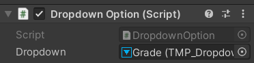
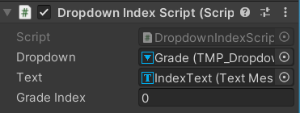

# Unity Dropdown 만들기


1. 2D Canvas 생성
2. Canvas에서 우클릭 > UI > Dropdown 생성


### Dropdown Option 커스텀

1. DropdownOption.cs 파일 생성

   ```c#
   using System.Collections;
   using System.Collections.Generic;
   using UnityEngine;
   using TMPro;
   
   public class DropdownOption : MonoBehaviour
   {
       [SerializeField]
       private TMP_Dropdown dropdown;
       private string[] gradeList = new string[6] {"1학년", "2학년", "3학년", "4학년", "5학년", "6학년"};
   
       private void Awake()
       {
           // 현재 dropdown에 있는 모든 옵션을 제거
           dropdown.ClearOptions();
   
           // 새로운 옵션 설정을 위한 OptionData 생성
           List<TMP_Dropdown.OptionData> optionList = new List<TMP_Dropdown.OptionData>();
   
           // gradeList 배열에 있는 모든 문자열 데이터를 불러와서 optionList에 저장
           foreach (string grade in gradeList)
           {
               optionList.Add(new TMP_Dropdown.OptionData(grade));
           }
   
           // 위에서 생성한 optionList를 dropdown의 옵션 값에 추가
           dropdown.AddOptions(optionList);
   
           // 현재 dropdown에 선택된 옵션을 0번으로 설정
           dropdown.value = 0;
       }
   }
   ```

   

2. Canavs > Create Empty (name: DropdownOption) 생성

3. DropdownOption 컴포넌트에 DropdownOption.cs 스크립트 삽입

4. 'Dropdown' 변수에 드롭다운 컴포넌트 drag & drop

   


<br>

### Dropdown 인덱스 번호 찾기

1. DropdownIndexScript.cs 작성

   ```c#
   using System.Collections;
   using System.Collections.Generic;
   using UnityEngine;
   using TMPro;
   
   public class DropdownIndexScript : MonoBehaviour
   {
       [SerializeField]
       private TMP_Dropdown dropdown;
       [SerializeField]
       public TextMeshProUGUI text;
       public int gradeIndex = 0;
   
       private void Awake()
       {
           dropdown.onValueChanged.AddListener(OnDropdownEvent);
       }
   
       public void OnDropdownEvent(int index)
       {
           text.text = $"Dropdown Index : {index}";
           gradeIndex = index;
           Debug.Log(gradeIndex);
       }
   }
   ```

   

2. Canvas 우클릭 > Create Empty (name: DropdownIndex)

3. Canvas 우클릭 > UI > Text (name: IndexText): Dropdown의 인덱스를 표시할 텍스트

4. DropdownIndex 컴포넌트에 DropdownIndexScript.cs 삽입

   

5. Play 해보면 Text 컴포넌트에 dropdown의 인덱스 번호가 나온다.


