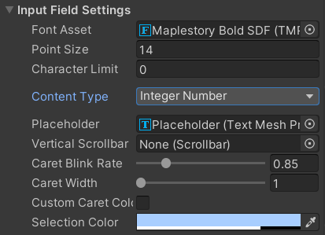
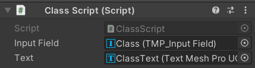

# Unity Input Field 만들기


1. 2D Canvas 생성

2. Canvas > UI > Input Field (name: 'Class') 생성

3. 'Class' input field 우클릭 > Inspector

   

   1. Content Type: Integer Number (글자 입력하면 null 값으로 취급)
   2. Caret Blink Rate: 커서 깜빡이는 속도
   3. Caret Width: 커서 너비
   4. Selection Color: 드래그 했을 때 나오는 색깔

**참고: content type**

* Standard: 모든 입력이 가능한 표준
* Autocorrected: 자동 수정 기능이 적용됨
* Integer Number: 정수만 입력 가능. 숫자 패드 등장.
* Decimal Number: 소수점이 있는 숫자 입력 가능. 기기에 따라 숫자를 입력하는 키보드 또는 숫자 패드 등장.
* Alphanumeric: 숫자와 영문자만 입력할 수 있음. 알파벳 입력용 키보드 등장.
* Name: 이름만 입력 가능(한글/영어). 알파벳의 경우 첫 문자와 공백 이후 첫 문자만 대문자로 설정되고 나머지는 모두 소문자로 설정된다.
* Email Address: 이메일 입력 (영어, 숫자, 일부 특수기호)
* Password: 암호 입력, 입력되는 모든 문자가 '*'로 표시
* Pin: PIN 입력. 입력이 완료된 후 InputField에 '*'로 표시된다.

**참고2**: TextMeshPro (InputField Component Event Method)

* On Value Changed(String): InputField의 데이터에 변화가 있을 때
* On End Edit (string): (Line Type이 Single Line일 때) InputField에 데이터를 입력하고 엔터를 눌렀을 때
* On Select (String): InputField를 마우스 커서로 클릭해 활성화 했을 때
* On Deselect (String): 다른 곳을 클릭해 InputField를 비활성화 했을 때

<br>

## Input Field에 입력한 값을 화면에 출력하기

1. ClassScript.cs 작성 (현재 input field의 이름이 class이기 때문)

   * **Tip.** 
     * InputField 컴포넌트는 UnityEngine.UI.InputField
     * TextMeshPro - InputField 컴포넌트는 TMPro.TMP_InputField
     * InputField의 이벤트 메소드들은 string 매개변수 1개를 가지고 있어야 한다.

   ```c#
   using System.Collections;
   using System.Collections.Generic;
   using UnityEngine;
   using TMPro;
   
   public class ClassScript : MonoBehaviour
   {
       [SerializeField] private TMP_InputField inputField;
       [SerializeField] private TextMeshProUGUI text;
   
       private int currentClass = -1;
   
       private void Awake()
       {
           //inputField.onValueChanged.AddListener(OnValueChangedEvent);
           inputField.onEndEdit.AddListener(OnEndEditEvent);
           inputField.onSelect.AddListener(OnSelectEvent);
           inputField.onDeselect.AddListener(OnDeselectEvent);
           inputField.onValueChanged.AddListener(GetClassNumber);
       }
   
       public void GetClassNumber(string str)
       {
           currentClass = int.Parse(str);
           Debug.Log(currentClass);
       }
   
       public void OnValueChangedEvent(string str)
       {
           text.text = $"Value Changed: {str}";
       }
   
       public void OnEndEditEvent(string str)
       {
           text.text = $"End Edit: {str}";
       }
   
       public void OnSelectEvent(string str)
       {
           text.text = $"Select: {str}";
       }
   
       public void OnDeselectEvent(string str)
       {
           text.text = $"Deselect: {str}";
       }
   }
   ```

   

2. Canavs에 ClassScript.cs 삽입

3. Canvas > Create Empty (name: ClassInputField)

   