## 개발 2주차 Unity 자율학습👼
 

## 2022. 10. 25. (화)

### 1. 기본 화면
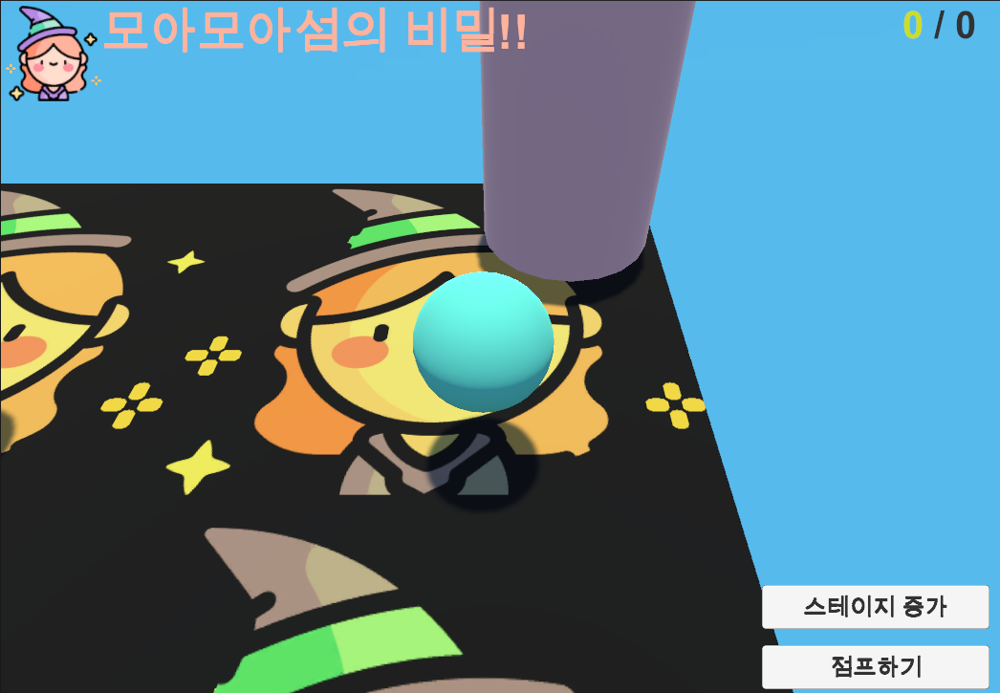

### 2. 아이템 획득
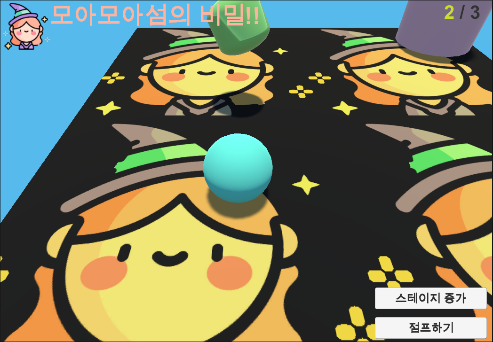

### 3. 스테이지 이동
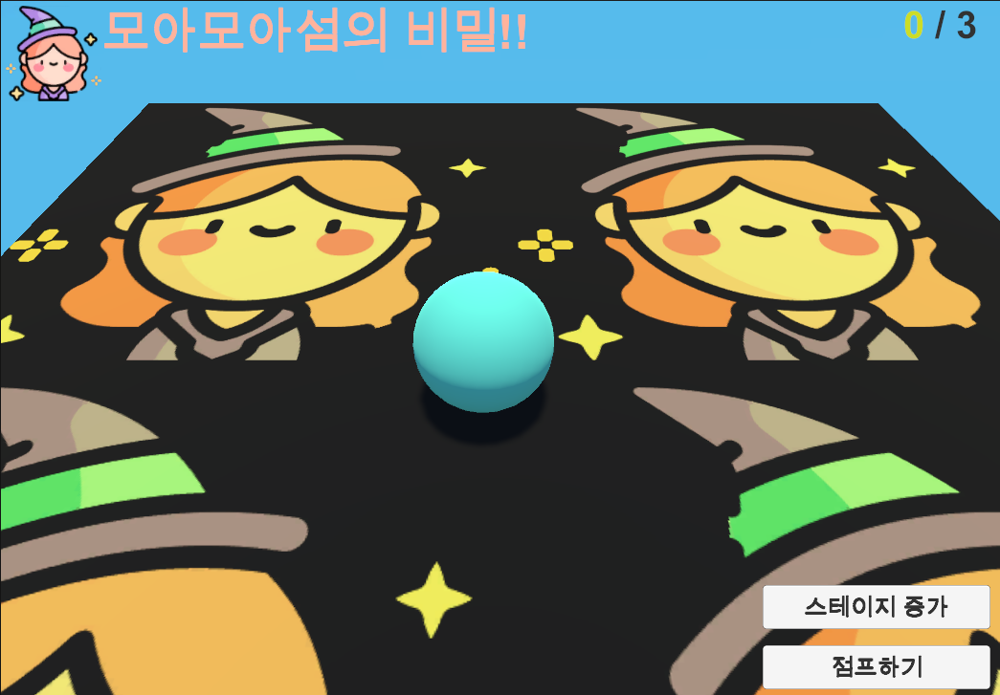

  

## 2022. 10. 26. (수)
### 1. 대화창 및 Asset 적용
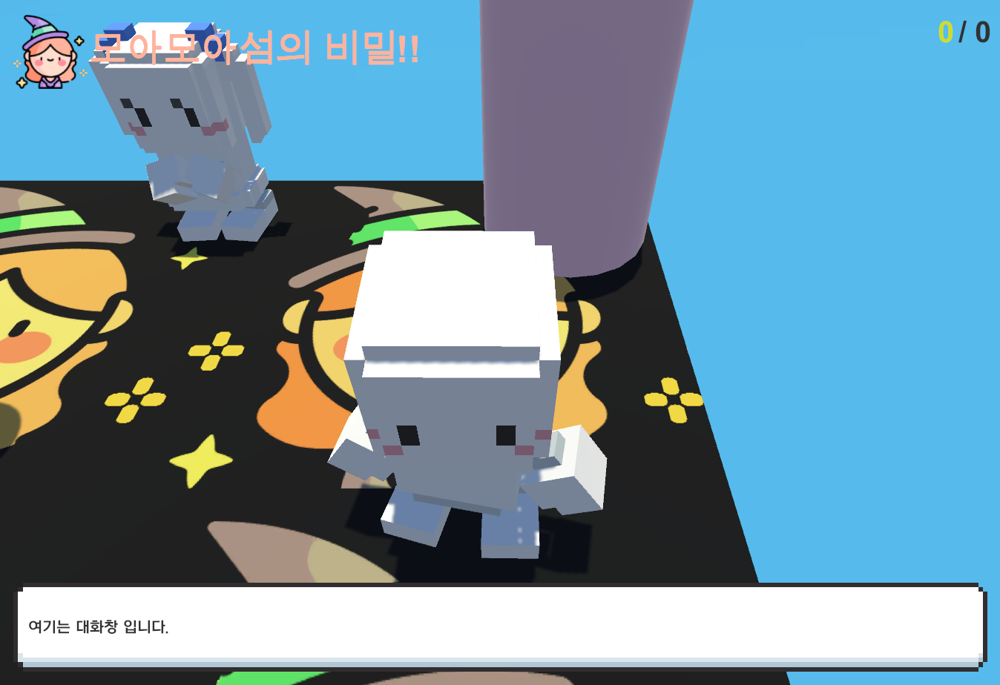

### 2. 떨어짐 방지 벽 설치
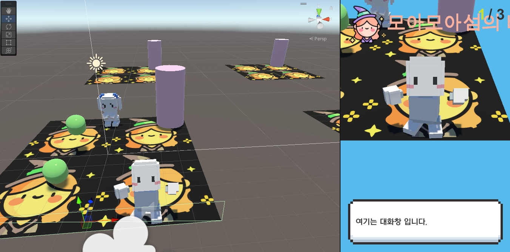

  

## 2022. 10. 27. (목)
### 1. 시작화면
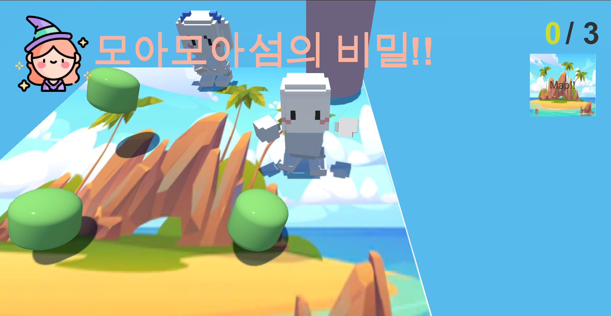

### 2. 아이템 먹기 게임
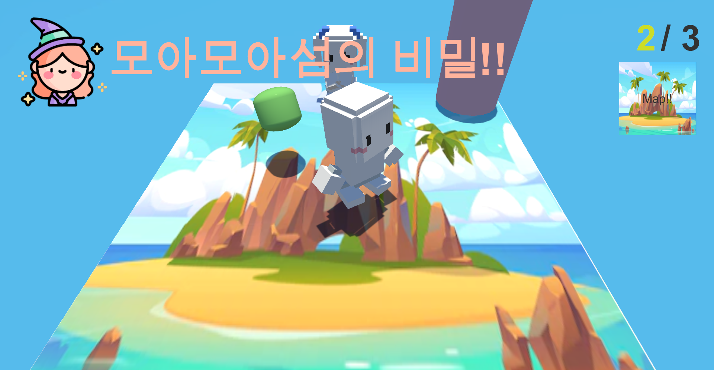

### 3. 게임 후 NPC 채팅
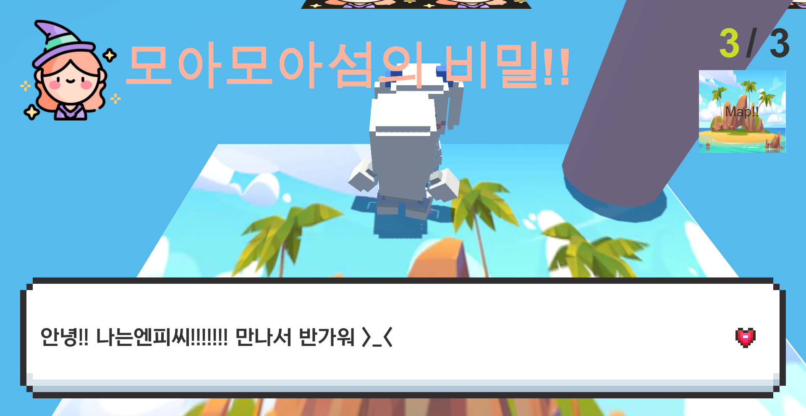

### 4. 지도 및 현위치
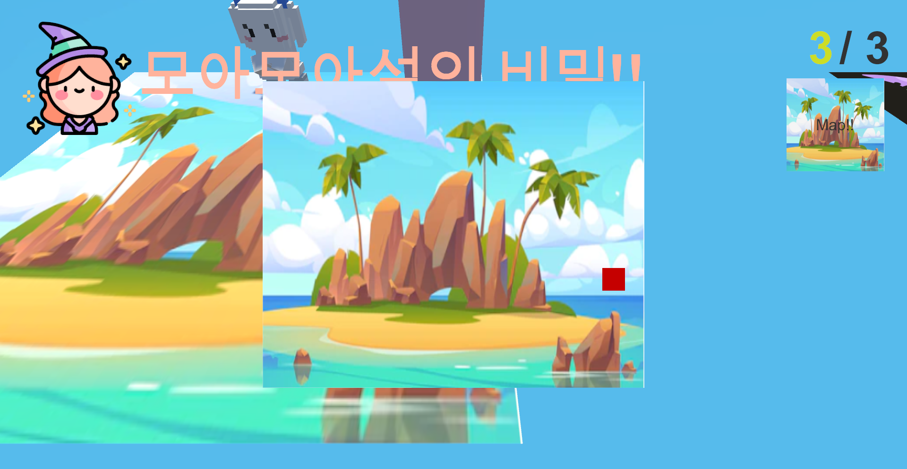

### 5. 게임 완료 후 씬 이동
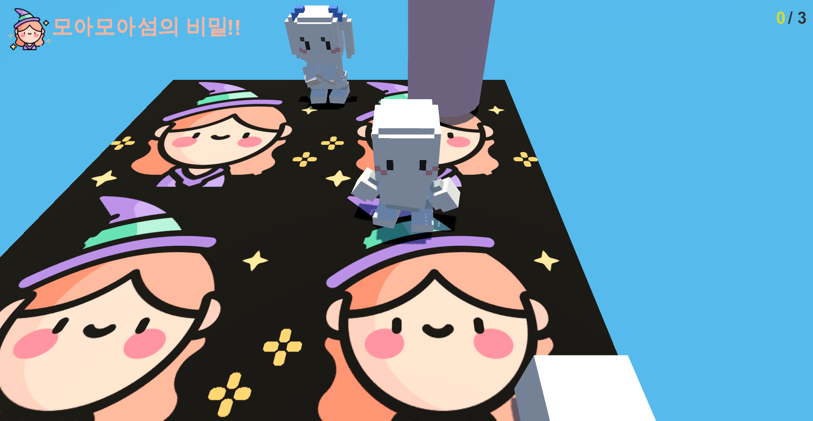

### 6. NPC 채팅

    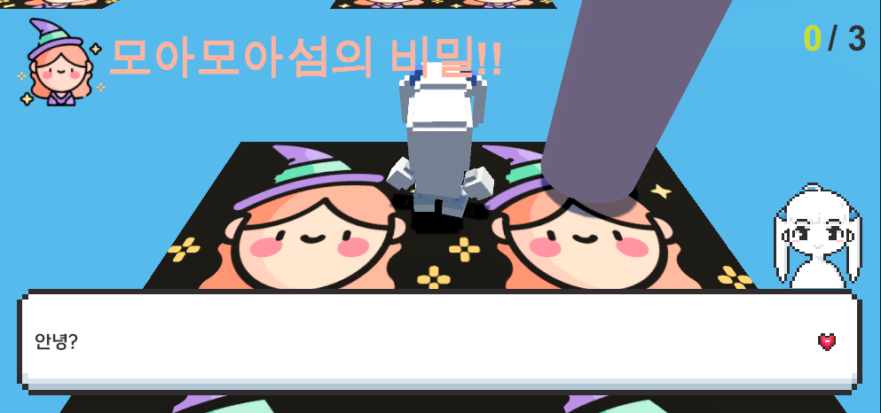
    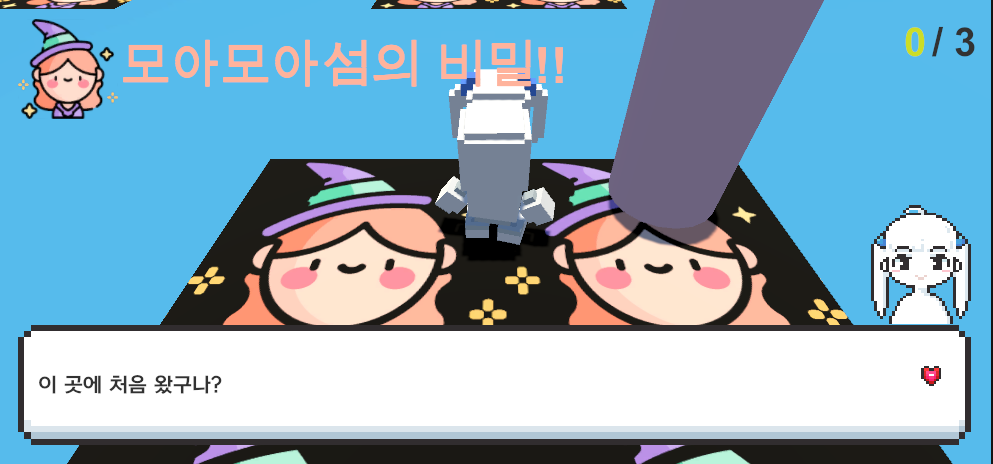
    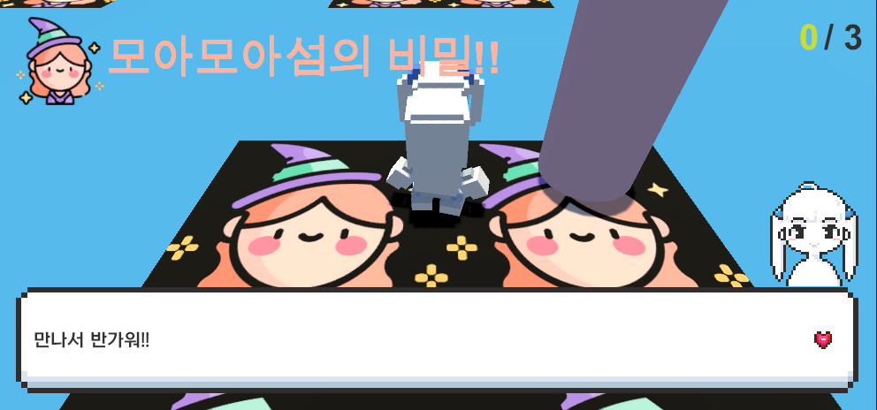

### 7. 사물 채팅

    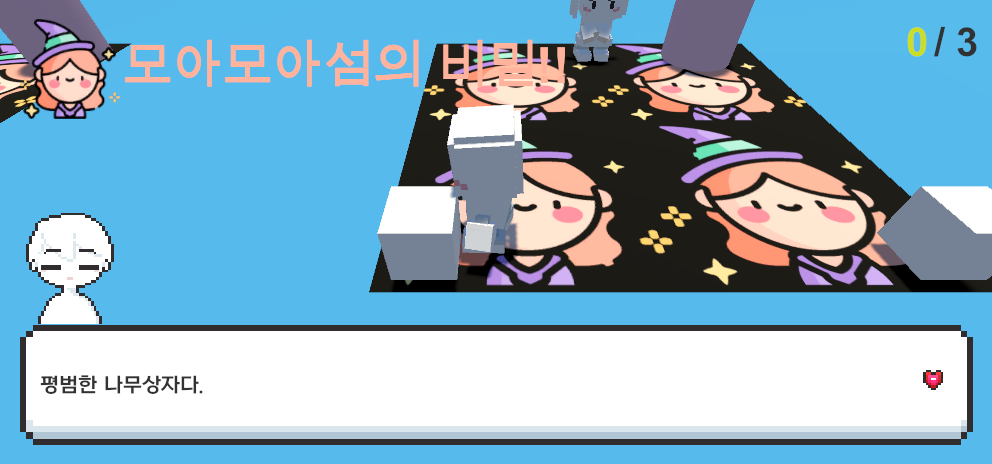
    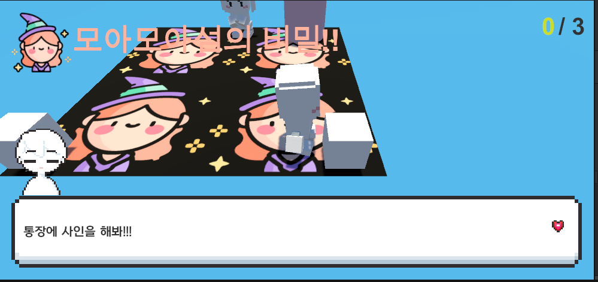

  

## 2022. 10. 28. (금)
### 1. 시작화면

### 1. 시작화면

### 1. 시작화면

### 1. 시작화면