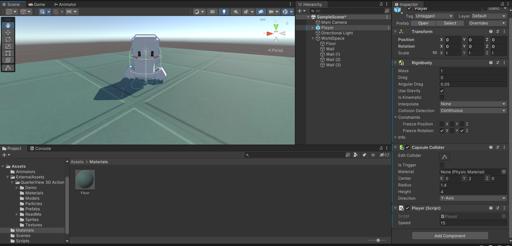
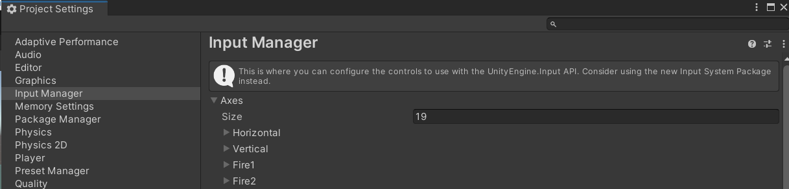
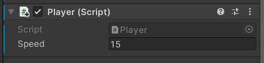
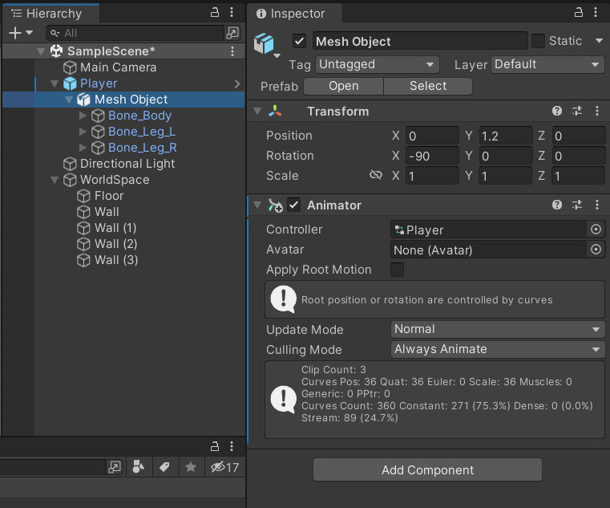
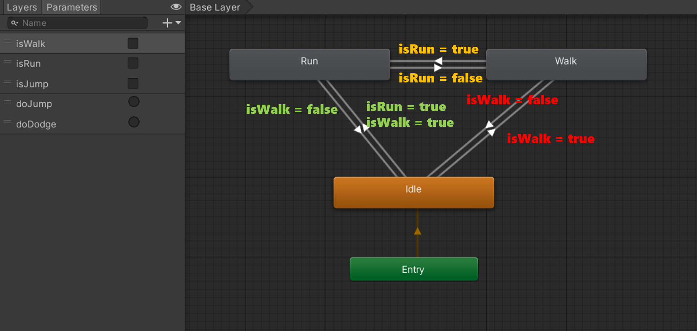

## 3D 캐릭터 이동 - 걷기, 달리기, 카메라 설정


### 1. 바닥이 될 [3D Object] - [Cube] 생성

* 오브젝트의 색상이 흰색이 아니라 칙칙할 경우
  * [Window] - [Rendering] - [Lighting Settings] - [Generate Lighting]을 통해 빛 생성
* Cube의 크기 지정 : (100, 1, 100)


### 2. 벽이 될 [3D Object] - [Cube] 4개 생성

* 4개의 큐브 오브젝트로 벽 생성
* [Inspector] - [Mesh Renderer] 체크 해제를 통해 Collider는 유지하지만 겉보기만 감추기 가능

### 3. Material 설정

* [우클릭] - [create] - [Material]
* Albedo 좌측 버튼 : 기본 제공되는 텍스처 선택 가능
* Albedo 우측 : 색상 지정 가능
* Tiling : 숫자를 늘려서 텍스쳐를 타일 형태로 배치


### 4. 생성한 Material을 Object에 적용

* 생성한 Material을 Object의 컴포넌트로 추가


### 5. 3D 캐릭터 생성

* Prefab : 게임 오브젝트를 에셋으로 보관된 형태, 미리 만들어진 오브젝트
* ❗ 캐릭터의 필요한 컴포넌트 : **Capsule Collider + Rigidbody + Script**
  * Rigidbody : 물리 효과
  * Capsule Collider : 최적 충돌
  * Script : C# 스크립트,  Add Component 또는 끌어놓기를 통해 컴포넌트에 추가

* Capsule Collider 설정 : 캐릭터의 중앙에 위치하며 캐릭터 전체를 감쌀 수 있도록 크기 조절




### 6. 캐릭터 기본 이동 구현

```c#
public class Player : MonoBehaviour
{

    public float speed; // 인스펙터 창에서 설정할 수 있도록 public 변수 추가

    // Input Axis 값을 받을 전역변수 선언
    float hAxis;
    float vAxis;

    Vector3 moveVec;

    void Start()
    {
        
    }

    void Update()
    {
        hAxis = Input.GetAxisRaw("Horizontal"); 
        vAxis = Input.GetAxisRaw("Vertical");

        moveVec = new Vector3(hAxis, 0, vAxis).normalized; 
        // Vector3(x, y, z)
        // normalized : 방향 값이 1로 보정된 벡터
        
		transform.position += moveVec * speed * Time.deltaTime;
    }
}

```

* Horizontal과 Vertical은 뭘까?

  * [Edit] - [Project Settings] - [Input Manager] - [Axes] 
  * Input Manager에서 관리, Name을 원하는 대로 바꾸어서 사용 가능
  * https://docs.unity3d.com/kr/2021.3/Manual/class-InputManager.html

  

* Vector3 
  * 3D 벡터의 값을 표현하기 위한 데이터 타입
  * transform 이동은 무조건 Vector3를 사용
  * x축은 Horizontal, z축은 Vertical을 사용
* normalized
  * 오브젝트 균일한 이동을 위한 벡터의 정규화
  * 방향 값이 1로 보정된 벡터로 어떤 방향이든 같은 값(속도)을 가질 수 있도록 함
* public으로 변수 선언 시 Inspector에서 값을 변경할 수 있음



### # 관성에 의해 캐릭터가 넘어지지 않도록 설정

* [Inspector] - [Rigidbody] - [Constraints] - [Freeze Rotation] - [X], [Z] 체크


### # 캐릭터의 transform 이동이 물리 충돌을 무시하는 경우 해결 방법

* [Inspector] - [Rigidbody] - [Collision Detection] - "Continuous" 변경

* 벽에 Collider를 넣어도 물체를 통과하는 경우
  * 물체의 가속도가 일정량 이상으로 올라가면 생기는 버그
  * [Inspector] - [Rigidbody] - [Interpolate] - "Extrapolate" 변경
  * [Inspector] - [Rigidbody] - [Collision Detection] - "Continuous Dynamic" 변경 : 성능이 많이 떨어지기 때문에 추천하지 않음!
  * 


### 7. 캐릭터 애니메이션 생성

* [Create] - [Animator Controller] 생성

* 생성한 Controller를 캐릭터의 자식 오브젝트(Mesh Object)에 끌어놓기




### 8. Animator Controller 



* Shift를 누르면 걷기 -> 달리기
* 각 애니메이션 상태를 [우클릭] - [Make Transition]을 통해 연결
* Parameters : 애니메이션 상태를 바꾸기 위한 조건
* Idle -> Walk : isWalk = true
* Walk -> Idle : isWalk = false
* Walk -> Run : isRun = true
* Run -> Walk : isRun = false
* Run -> Idle : isWalk = false // Shift를 떼도 달리기에서 걷기, 걷기에서 멈추기를 위함
* Idle -> Run : isWalk = true, isRun = true (걷기와 달리기 둘 다 만족해야 함)

* Transition 선택 후 Inspector 설정
  * [Has exit Time] 체크 해제
  * [Settings] - [Transition Duratior] 애니메이션 시간 설정
  * [Conditions] 조건 추가


* Size 조절을 통해 Axes 속성을 추가 가능

  * Name : Run
  * Positive button : left shift
  * 왼쪽 shift를 누르면 Run

  

```c#
// Player.cs
using System.Collections;
using System.Collections.Generic;
using UnityEngine;

public class Player : MonoBehaviour
{

    public float speed;

    float hAxis;
    float vAxis;
    bool runDown; // runDown : Shift를 누르면 달리기

    Vector3 moveVec;

    Animator anim;

    void Start()
    {
        // Animator 컴포넌트 가져오기
        // Animator 컴포넌트를 Player 안에 Child로 넣어놓았기 때문에 가져올 때 또한 GetComponent가 아닌 GetComponentInChild를 이용해야 함
        anim = GetComponentInChildren<Animator>();
    }   

    void Update()
    {
        hAxis = Input.GetAxis("Horizontal");
        vAxis = Input.GetAxis("Vertical");
        runDown = Input.GetButton("Run"); // Left Shift 버튼을 꾹 누르고(=>GetButton) 있어야만 달리기 가능 


        moveVec = new Vector3(hAxis, 0, vAxis).normalized; // x, y, z
                                                           // normalized : 어떤 방향이든 같은 값(속도)을 가질 수 있도록 함, 방향 값이 1로 보정된 벡터

        if(runDown) // 달리기
            transform.position += moveVec * speed* Time.deltaTime; // transform 이동은 꼭 Time.deltaTime까지 곱해줌!
        else // 걷기
            transform.position += moveVec * speed * 0.3f * Time.deltaTime; // 걷기는 속도가 더 느리기 때문에 *0.3f

        // SetBool 함수로 파라미터 값 설정
        anim.SetBool("isWalk", moveVec != Vector3.zero);
        anim.SetBool("isRun", runDown);

        // 앞으로 나아가는 방향을 바라본다.
        transform.LookAt(transform.position + moveVec);
    }
}

```

* Input.GetAxis() : -1, 0, 1, 세 가지 값 중 하나가 반환, 키보드 값을 눌렀을 때 즉시 반응해야 할 경우에 사용
* Input.GetAxisRaw() : -1.0f ~ 1.0f 까지의 범위의 값을 반환, 부드러운 이동이 필요한 경우에 사용
* Time.deltaTime() : Time.deltaTime을 사용하면 프레임이 달라져도 동일한 성능을 낼 수 있음


### 9. 기본 회전 구현

```c#
// 앞으로 나아가는 방향을 바라본다.
transform.LookAt(transform.position + moveVec);
```


### 10. 카메라 이동

```c#
// Follow.cs
using System.Collections;
using System.Collections.Generic;
using UnityEngine;

public class Follow : MonoBehaviour
{
    // 카메라가 따라다녀야 할 타겟
    public Transform target;
    // 보정값:  따라갈 목표와 위치 오프셋을 public 변수로 선언
    public Vector3 offset;

    void Update()
    {
        transform.position = target.position + offset;        
    }
}

```


* Main Camera에 "Follow.cs" Script Component 추가
* Target : 따라다녀야 할 캐릭터 설정
* Offset : 캐릭터의 위치와 동일한 좌표를 넣고, 원하는 카메라 위치로 좌표 설정


------

### 11. 캐릭터 걷기, 달리기까지 최종 코드(함수 정리)

```c#
using System.Collections;
using System.Collections.Generic;
using UnityEngine;

public class Player : MonoBehaviour
{

    public float speed;

    float hAxis;
    float vAxis;
    bool runDown; // runDown : Shift를 누르면 달리기

    Vector3 moveVec;

    Animator anim;

    void Start()
    {
        // Animator 컴포넌트 가져오기
        // Animator 컴포넌트를 Player 안에 Child로 넣어놓았기 때문에 가져올 때 또한 GetComponent가 아닌 GetComponentInChild를 이용해야 함
        anim = GetComponentInChildren<Animator>();
    }   

    void Update()
    {
        GetInput(); // 제일 위에 작성

        Move();
        Turn();
    }

    void GetInput()
    {
        hAxis = Input.GetAxis("Horizontal");
        vAxis = Input.GetAxis("Vertical");
        runDown = Input.GetButton("Run"); // Left Shift 버튼을 꾹 누르고(=>GetButton) 있어야만 달리기 가능 
    }

    void Move()
    {
        moveVec = new Vector3(hAxis, 0, vAxis).normalized; // x, y, z
                                                           // normalized : 어떤 방향이든 같은 값(속도)을 가질 수 있도록 함, 방향 값이 1로 보정된 벡터

        if (runDown) // 달리기
            transform.position += moveVec * speed * 3.0f * Time.deltaTime; // transform 이동은 꼭 Time.deltaTime까지 곱해줌!
        else // 걷기
            transform.position += moveVec * speed * 1f * Time.deltaTime; // 걷기는 속도가 더 느리기 때문에 *0.3f

        // SetBool 함수로 파라미터 값 설정
        anim.SetBool("isWalk", moveVec != Vector3.zero);
        anim.SetBool("isRun", runDown);
    }

    void Turn()
    {
        // 나아가는 방향을 바라본다.
        transform.LookAt(transform.position + moveVec);
    }
}

```


### 12. 캐릭터 점프 코드 구현

* Floor 오브젝트에 태그 추가
* [Inspector] - [Tag] - [Add Tag] - [+] - "사용할 태그명 지정"


```c#
using System.Collections;
using System.Collections.Generic;
using UnityEngine;

public class Player : MonoBehaviour
{

    public float speed;
    public float jumpPower;

    float hAxis;
    float vAxis;
    bool runDown; 
    bool jumpDown; // jumpDown : Space를 누르면 점프

    bool isJump; // 점프 수행 여부

    Vector3 moveVec;

    Rigidbody rigid; // 물리 효과를 위해 Rigidbody 변수 선언
    Animator anim;

    void Start()
    {
        anim = GetComponentInChildren<Animator>();
        rigid = GetComponent<Rigidbody>(); // Child이 아니기 때문에 GetComponent 사용 
    }   

    void Update()
    {
        GetInput(); 

        Move();
        Turn();  
        Jump();
    }

    void GetInput()
    {
        hAxis = Input.GetAxis("Horizontal");
        vAxis = Input.GetAxis("Vertical");
        runDown = Input.GetButton("Run"); 
        jumpDown = Input.GetButtonDown("Jump"); // Space를 누르는 즉시 점프
    }

    void Move()
    {
        moveVec = new Vector3(hAxis, 0, vAxis).normalized; 
        if (runDown) // 달리기
            transform.position += moveVec * speed * 3.0f * Time.deltaTime; 
        else 
            transform.position += moveVec * speed * 1f * Time.deltaTime; 


        anim.SetBool("isWalk", moveVec != Vector3.zero);
        anim.SetBool("isRun", runDown);
    }

    void Turn()
    {
        transform.LookAt(transform.position + moveVec);
    }

    void Jump()
    {
        if(jumpDown && !isJump) // Space를 눌렀고, 점프 중인 상태가 아닐 때 => 점프 가능
        {
            rigid.AddForce(Vector3.up * jumpPower, ForceMode.Impulse); // AddForce 함수로 물리적인 힘을 가할 수 있음
            isJump = true;
        }

    }

    // 충돌 정보를 얻을 수 있는 함수
    private void OnCollisionEnter(Collision collision)
    {
        // 충돌한 게임 오브젝트의 태그가 "Floor" 일 경우
        if(collision.gameObject.tag == "Floor")
        {
            isJump = false; // 바닥과 충돌
        }
    }
}

```


### 13. 캐릭터 점프 애니메이션

* AnyState로 아무 때나 실행, Exit으로 원상복귀


### # 3인칭 시점 이동 코드

```c#
using System.Collections;
using System.Collections.Generic;
using UnityEngine;

public class Player : MonoBehaviour
{

    public float speed;
    public float jumpPower;

    float hAxis;
    float vAxis;
    bool runDown; // runDown : Shift를 누르면 달리기
    bool jumpDown; // jumpDown : Space를 누르면 점프

    bool isJump; // 점프 수행 여부

    Vector3 moveVec;

    Rigidbody rigid; // 물리 효과를 위해 Rigidbody 변수 선언
    Animator anim;

    void Start()
    {
        // Animator 컴포넌트 가져오기
        // Animator 컴포넌트를 Player 안에 Child로 넣어놓았기 때문에 가져올 때 또한 GetComponent가 아닌 GetComponentInChild를 이용해야 함
        anim = GetComponentInChildren<Animator>();
        rigid = GetComponent<Rigidbody>(); // Child이 아니기 때문에 GetComponent 사용 
    }   

    void Update()
    {
        GetInput(); // 제일 위에 작성

        Move();
        Turn();  
        Jump();
    }

    void GetInput()
    {
        hAxis = Input.GetAxisRaw("Horizontal");
        vAxis = Input.GetAxisRaw("Vertical");
        runDown = Input.GetButton("Run"); // Left Shift 버튼을 꾹 누르고(=>GetButton) 있어야만 달리기 가능 
        jumpDown = Input.GetButtonDown("Jump"); // Space를 누르는 즉시 점프
    }

    void Move()
    {
        moveVec = new Vector3(hAxis, 0, vAxis).normalized; // x, y, z
                                                           // normalized : 어떤 방향이든 같은 값(속도)을 가질 수 있도록 함, 방향 값이 1로 보정된 벡터

        if (runDown) // 달리기
            transform.position += moveVec * speed * 3.0f * Time.deltaTime; // transform 이동은 꼭 Time.deltaTime까지 곱해줌!
        else // 걷기
            transform.position += moveVec * speed * 1f * Time.deltaTime; // 걷기는 속도가 더 느리기 때문에 *0.3f

        // SetBool 함수로 파라미터 값 설정
        anim.SetBool("isWalk", moveVec != Vector3.zero);
        anim.SetBool("isRun", runDown);
    }

    void Turn()
    {
        // 나아가는 방향을 바라본다.
        transform.LookAt(transform.position + moveVec);
    }

    void Jump()
    {
        if(jumpDown && !isJump) // Space를 눌렀고, 점프 중인 상태가 아닐 때 => 점프 가능
        {
            rigid.AddForce(Vector3.up * jumpPower, ForceMode.Impulse); // AddForce 함수로 물리적인 힘을 가할 수 있음
            isJump = true;
        }

    }

    // 충돌 정보를 얻을 수 있는 함수
    private void OnCollisionEnter(Collision collision)
    {
        // 충돌한 게임 오브젝트의 태그가 "Floor" 일 경우
        if(collision.gameObject.tag == "Floor")
        {
            isJump = false; // 바닥과 충돌
        }
    }
}
// 코드 보관
```


* [Hierarchy] - [Main Camera] - Child 속성으로 들어가지 않음

* [Main Camera] - "Follow.cs" 파일 체크

  

### # 1인칭(뒷모습) 시점 이동 코드

```c#
using System.Collections;
using System.Collections.Generic;
using UnityEngine;

public class Player : MonoBehaviour
{

    public float speed;
    public float jumpPower;

    float hAxis;
    float vAxis;
    bool runDown; // runDown : Shift를 누르면 달리기
    bool jumpDown; // jumpDown : Space를 누르면 점프

    bool isJump; // 점프 수행 여부

    Vector3 moveVec;

    Rigidbody rigid; // 물리 효과를 위해 Rigidbody 변수 선언
    Animator anim;

    void Start()
    {
        // Animator 컴포넌트 가져오기
        // Animator 컴포넌트를 Player 안에 Child로 넣어놓았기 때문에 가져올 때 또한 GetComponent가 아닌 GetComponentInChild를 이용해야 함
        anim = GetComponentInChildren<Animator>();
        rigid = GetComponent<Rigidbody>(); // Child이 아니기 때문에 GetComponent 사용 
    }   

    void Update()
    {
        GetInput(); // 제일 위에 작성

        Move(); 
        Jump();
    }

    void GetInput()
    {
        hAxis = Input.GetAxisRaw("Horizontal");
        vAxis = Input.GetAxisRaw("Vertical");
        runDown = Input.GetButton("Run"); // Left Shift 버튼을 꾹 누르고(=>GetButton) 있어야만 달리기 가능 
        jumpDown = Input.GetButtonDown("Jump"); // Space를 누르는 즉시 점프
    }

    void Move()
    {
        moveVec = new Vector3(hAxis, 0, vAxis).normalized; // x, y, z
                                                           // normalized : 어떤 방향이든 같은 값(속도)을 가질 수 있도록 함, 방향 값이 1로 보정된 벡터

        if (runDown) // 달리기
            Walk(3.0f); // 달리기 속도는 걷기보다 빠르기 때문에 3.0f
        else // 걷기
            Walk(1.0f); // 걷기 1.0f 속도

        // SetBool 함수로 파라미터 값 설정
        anim.SetBool("isWalk", moveVec != Vector3.zero);
        anim.SetBool("isRun", runDown);
    }

    void Walk(float speedVal)
    {
        moveVec = new Vector3(hAxis, 0, vAxis).normalized;
        if (vAxis > 0)
        {
            this.transform.Translate(Vector3.forward * speed * speedVal * Time.deltaTime);
        }
        if(vAxis < 0)
        {
            this.transform.Translate(Vector3.back * speed * speedVal * Time.deltaTime);
        }
       if(hAxis < 0) 
        {
            if(vAxis >= 0)
            {
                // 회전 속도를 올리기 위해 speed에 *10을 더 해줌(일반적으로 회전 속도를 이동 속도보다 더 크게함)
                this.transform.Rotate(0, -speed  * Time.deltaTime * 10, 0); // 왼쪽 + 위 방향키 : 왼쪽으로 회전
            }
            else
            {
                this.transform.Rotate(0, speed * Time.deltaTime * 10, 0); // 왼쪽 + 아래 방향키 : 오른쪽으로 회전
            }
        }
        if (hAxis > 0)
        {
            if (vAxis >= 0)
            {
                this.transform.Rotate(0, speed * Time.deltaTime * 10, 0);  // 오른쪽 + 위 방향키 : 오른쪽으로 회전
            }
            else
            {
                this.transform.Rotate(0, -speed * Time.deltaTime * 10, 0); // 오른쪽 + 아래 방향키 : 왼쪽으로 회전 
            }
        }
    }


	// 점프는 제대로 작동 안 할 수 있음.. 수정 예정
    void Jump()
    {
        if(jumpDown && !isJump) // Space를 눌렀고, 점프 중인 상태가 아닐 때 => 점프 가능
        {
            rigid.AddForce(Vector3.up * jumpPower, ForceMode.Impulse); // AddForce 함수로 물리적인 힘을 가할 수 있음
            isJump = true;
        }

    }

    // 충돌 정보를 얻을 수 있는 함수
    private void OnCollisionEnter(Collision collision)
    {
        // 충돌한 게임 오브젝트의 태그가 "Floor" 일 경우
        if(collision.gameObject.tag == "Floor")
        {
            isJump = false; // 바닥과 충돌
        }
    }
}

```


* [Hierarchy] - 캐릭터 내부로 [Main Camera] 이동 
* "Follow.cs" 파일 체크 해제

